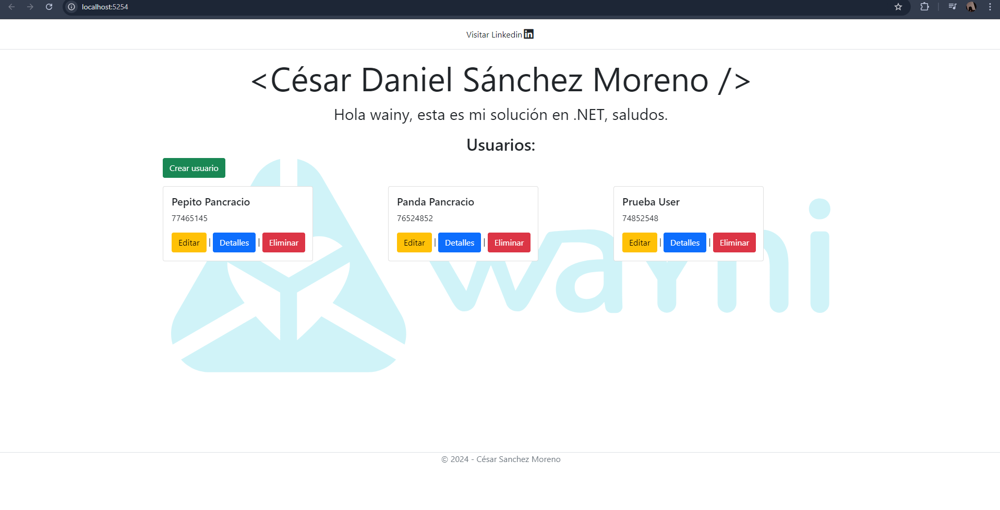

# App Usuarios

## Descripción
Este proyecto es una aplicación web para la gestión de usuarios, donde puedes realizar operaciones CRUD (Crear, Leer, Actualizar, Eliminar) sobre los usuarios. Utiliza ASP.NET Core con Entity Framework para interactuar con la base de datos.

## Tecnologías Utilizadas
- **Visual Studio 2022**
- **ASP.NET Core (versión 8.0.400)**
- **Entity Framework**
- **SQL Server** (o el sistema de base de datos que hayas elegido)
- **HTML/CSS** para la interfaz de usuario

## Requisitos Previos
Asegúrate de tener instaladas las siguientes herramientas:
- [.NET SDK](https://dotnet.microsoft.com/download/dotnet)
- Un servidor de base de datos SQL Server (o el que hayas elegido), puedes utilizar Sql Management.

## Configuración del Proyecto

1. **Clonar el Repositorio:**
   ```bash
   git clone https://github.com/Cesar-Sanchez-DEV/App-usuarios.git
   cd App_usuarios
2. **Instalar los Paquetes NuGet:**
   - Abre **Visual Studio 2022**.
   - Ve a la pestaña **Herramientas** > **Administración de paquetes NuGet** > **Administrar paquetes NuGet para la solución**.
   - Revisa si tienes los siguientes paquetes instalados:
   - Microsoft.EntityFrameworkCore.SqlServer.
   - Microsoft.EntityFrameworkCore.Tools.
   
4. **Crear la base de datos:** Para crear la base de datos, puedes usar la siguiente sentencia SQL:
   ```sql
   CREATE DATABASE Nombre_de_la_BD
   USE Nombre_de_la_DB
   CREATE TABLE nombre_de_la_tabla(
   	id int identity(1,1) primary key,
   	nombre varchar(250),
   	apellido varchar(250),
   	dni varchar(15)
   )
5. **Usar Package Manager Console:**
   - Abre **Visual Studio 2022**.
   - Ve a la pestaña **Herramientas** > **Administración de paquetes NuGet** > **Consola del Administrador de paquetes**.
   - Ejecuta el siguiente comando:
   ```bash
   Scaffold-DbContext "server=localhost; database=Nombre_de_la_BD; integrated security=true; Encrypt=false; Trusted_Connection=true;" Microsoft.EntityFrameworkCore.SqlServer -OutPutDir Models
   ```
   **Asegúrate** de tener el paquete `Microsoft.EntityFrameworkCore.Tools` instalado ya que es necesario para ejecutar comandos de scaffolding.
6. **Modificar archivos:**
   Una vez ejecutado el comando scaffolding tienes que ingresar al archivo que se abre automaticamente al ejecutar el comando **`Nombre_de_la_BD`Context** y comentar estas líneas:
   ```csharp
   //#warning To protect potentially sensitive information in your connection string, you should move it out of source code. You can avoid scaffolding the connection string by using the Name= syntax to read it from configuration - see https://go.microsoft.com/fwlink/?linkid=2131148. For more guidance on storing connection strings, see https://go.microsoft.com/fwlink/?LinkId=723263.
   //=> optionsBuilder.UseSqlServer("server=localhost; database=GestionUser; integrated security=true; Encrypt=false; Trusted_Connection=true;");
   ```
   Si llega a salir error, reemplazar toda la función por esta:
   ```csharp
   protected override void OnConfiguring(DbContextOptionsBuilder optionsBuilder)
    {
        if (!optionsBuilder.IsConfigured)
        {
   //#warning To protect potentially sensitive information in your connection string, you should move it out of source code. You can avoid scaffolding the connection string by using the Name= syntax to read it from configuration - see https://go.microsoft.com/fwlink/?linkid=2131148. For more guidance on storing connection strings, see https://go.microsoft.com/fwlink/?LinkId=723263.
   //        => optionsBuilder.UseSqlServer("server=localhost; database=GestionUser; integrated security=true; Encrypt=false; Trusted_Connection=true;");
           }
   }
   ```
   Una vez modificado el archivo: **`Nombre_de_la_BD`Context** tienes que ingresar al archivo **appsetings.json** y agregar "ConnectionStrings", te tiene que quedar similar a esto:
   ```json
      {
     "Logging": {
       "LogLevel": {
         "Default": "Information",
         "Microsoft.AspNetCore": "Warning"
       }
     },
     "AllowedHosts": "*",
     "ConnectionStrings": {
       "conexion": "server=localhost; database=GestionUser; integrated security=true; Encrypt=false; Trusted_Connection=true;"
     }
   }
   ```
   Una vez configurado **appsetings.json** ejecuta la aplicación presionando **F5** o dandole click al botón de iniciar aplicación abajo de las pestañas principales de **Visual Studio 2022**
## Vista Previa de la aplicación:


   
### Instrucciones para completar
- **Reemplaza** `Nombre_de_la_BD` y `nombre_de_la_tabla` con los valores correspondientes.
- **Añade** tus capturas de pantalla en la sección "Capturas de Pantalla" para mostrar la aplicación en funcionamiento.
- **Considera** agregar cualquier otra información adicional que consideres relevante para los usuarios de tu proyecto.

## Contacto
Si necesitas más ayuda, no dudes en contactarme:
- **LinkedIn:** [Cesar Sanchez](https://www.linkedin.com/in/cesar-sanchez-moreno/)
- **Celular:** +51 928 376 511
